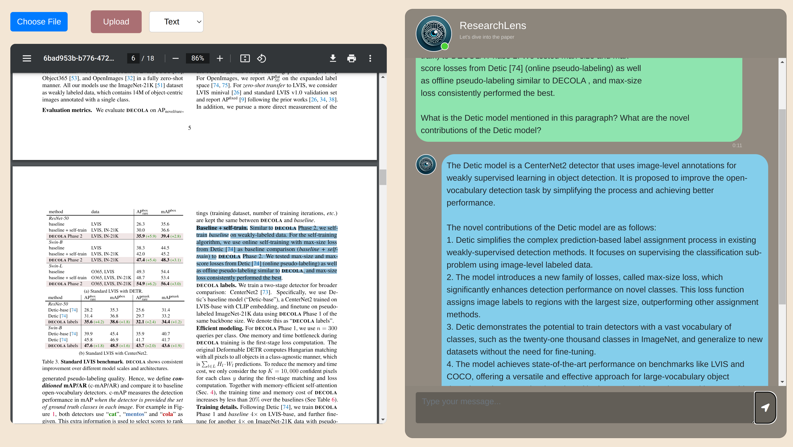

<h1 align="center">ResearchLens</h1>

<p align="center">
  
  <br>Your paper-reading assistant powered by LLMs.
</p>

ResearchLens is an innovative paper reading assistant utilizing Large Language Models (LLMs), enhanced by Retrieval Augmented Generation (RAG) and our Generation Augmented Generation (GAG) techniques, alongside advanced reference management capabilities to streamline the comprehension of complex academic literature. It also features an optional math-fine-tuned model for better explanation of mathematical content.

* Document parsing with PyMuPDF, anystyle NER and Semantic Scholar API for reference extraction
* LlamaIndex for RAG
* Cohere command-r and math fine-tuned llama2 for generation
* Simple flask server and chat UI



## Setup

### Python

Install the required python packages using the following command:

```bash
pip install -r requirements.txt
```

### Anystyle

[Anystyle](https://github.com/inukshuk/anystyle) is a tool for extracting bibliographic data from unstructured text. We use a docker image to run a simple ruby server which is available in `src/server/anystyle/Dockerfile`. Specify the URL where the server is running in the appropriate modules.

### Misc

You have to provide your API keys for semantic scholar, huggingface and cohere to use our models. You can set the environment variables `SEMANTIC_SCHOLAR_API_KEY`, `HUGGINGFACE_API_KEY` and `COHERE_API_KEY` to the respective keys.

## Usage

To use the chat app just run the `run.sh` script from the project root.

## Modules

| **Directory**  | **Description**                                                           |
|----------------|---------------------------------------------------------------------------|
| experiments    | Code containing experimental code for the project                         |
| src/rag        | Modules for Retrieval Augmented Generation (RAG) to be used with the chat |
| src/refextract | Modules for extracting references and downloading metadata                |
| src/server     | UI and backend code for the chat application                              |
| src/anystyle   | Simple ruby server for anystyle ruby library.                             |

## Contributors

Abhishek Reddy Andluru \
Rohit Sisir Sahoo \
Surya Krishnamurthy \
Venkata Sai Ujwala Bayana
